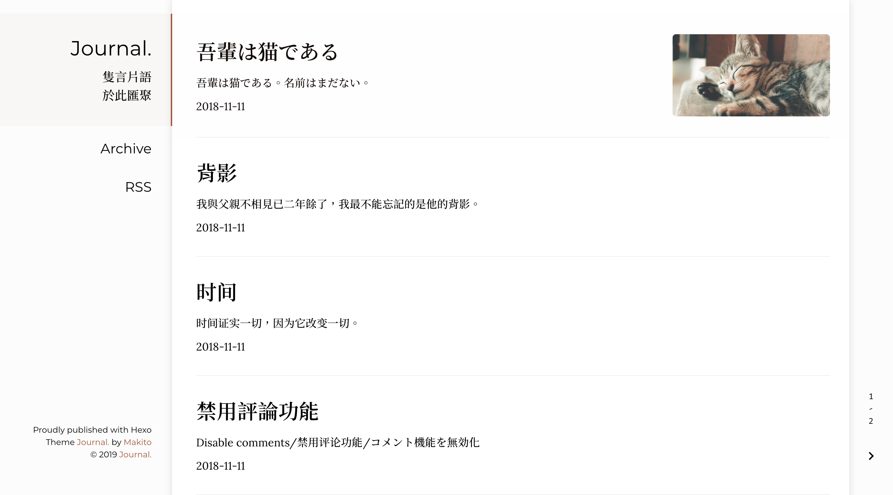

Journal.
======
隻言片語・於此匯聚

Moments piled up.



> This documentation is yet to be finished.

### Features

- Simple and easy to customize
- Concentrated on reading <del>and writing (find a Markdown editor then)</del> experience
- Mobile-friendly & widescreen-friendly
- Flexible commenting control

### Installation

First, `cd` into your Hexo root directory.

#### Installing the EJS renderer

> If you are currently using an EJS-based theme, you can then skip this step.

```bash
yarn add hexo-renderer-ejs
npm i --save hexo-renderer-ejs # for npm users
```

#### Cloning the theme

```bash
cd themes
git clone https://github.com/SumiMakito/hexo-theme-Journal.git journal
cd journal
yarn install # or `npm i` for npm users
```

#### Applying the theme

Find the _config.yml file at your Hexo root directory and apply the theme.

```yaml
theme: journal
```

### User Guide

#### About post items


<div align="center"><small>↑ An example of a post item ↑</small></div>

Generally speaking, a post file in source/_posts or a page file always begins with a header in the following format.

```yaml
---
title: 吾輩は猫である
intro: 吾輩は猫である。名前はまだない。
featured_image: neko.jpg
date: 2018-11-11 12:00:00
tags: 
    - Novel
    - Japanese
---
```

Maybe you've already noticed that there're two new fields named `intro` and `featured_image`. These two **optional** fields are used to optimize post items' appearance. If `intro` is set, the value will be used as abstract instead of the automatically truncated one. If `featured_image` presents, the image specified will show up in the post item, also, the feature image will show up in the detailed post's or page's page. In this example, the `neko.jpg` is placed in the asset folder for the post or page.

#### Disabling commenting

You are free to choose whether or not to disable commenting on some posts or pages at all times as you like it since you're the owner.

You can disable commenting just by adding one line of code in the header of a post or page file.

```yaml
---
...
no_comments: true
...
---
```

